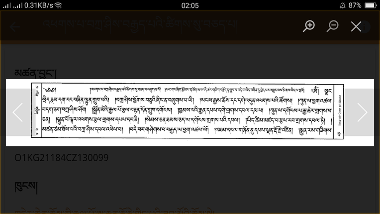

## BDRC Library Mobile App

The **BDRC Lib** app provides direct access to BDRC’s library on mobile devices to benefit BDRC’s global users, particularly where access to the Internet is less reliable. It is currently available in Tibetan language, and will be made available in both English and Chinese in a forthcoming release. 

 

The FRs and DPEs who use iPhones can download the app from the [App Store](https://itunes.apple.com/us/app/bdrc-lib/id1254032189?mt=8). Those who are on Android can use the following link, or download it from [Google Play](https://play.google.com/store/apps/details?id=org.tbrc.bdrclibapp).

 <a href="https://github.com/BuddhistDigitalResourceCenter/digitization-guidelines/releases/download/v1.0.0/android-release.apk"><button type="button" class="btn btn-primary btn-md"><i class="fa fa-android"></i>  BDRC-Lib v1.0.0</button></a>

## Offline Access to Metadata

The App is designed to work offline to search the vast repository of more than 350,000 Tibetan titles in the BDRC library. The DPEs and Frs can look for a work by searching metadata including 1) the title of the work, 2) titles of texts contained in that work, 3) any of the author's names, 4) publication information. The metadata search will work whether or not the device is connected to the Internet.

 

## Online Access to Scanned Texts

Once online, the staff can browse the scanned page images. The book will open on the cover page and the colophon at the end of the book can be accessed easily by swiping from left to right. This makes the identification of a work much easier.

## Future Releases

BDRC is planning on two additional releases soon, so please stay tuned for updates. The second release will include a library update feature to allow users to easily access the latest data from the BDRC Library database. The second release will include localizations in English and Chinese, as well as the ability to download PDF versions of the texts. The third release will include collaborative features such as request a text to be scanned, suggest edits to records, suggest a text to include in the library, and a desktop application that will provide direct access to the BDRC Library on the desktop. Collaborative features will allow readers to interact more with BDRC library workflow and library accessions.