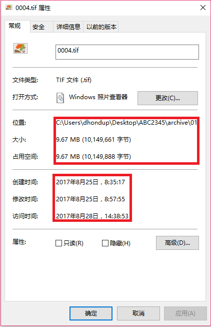
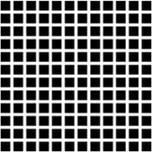
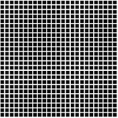
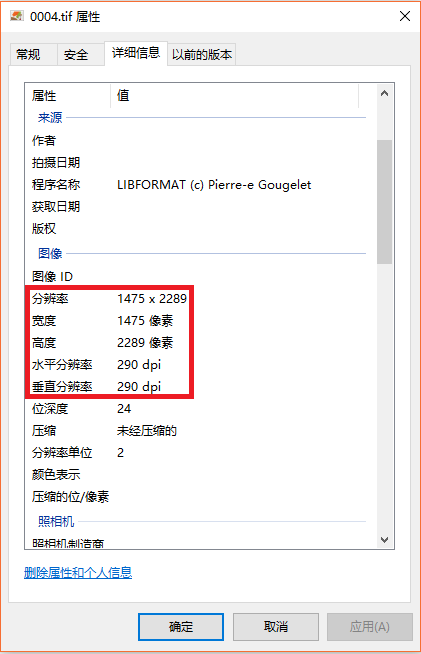


**1. Selecting ****Digital**** Objects**

First, new objects for the collection must be **selected**. One important way in which BDRC differs from other libraries is in **scope**. The potential acquisitions are thus generally **Buddhist** (or otherwise significant to a Buddhist culture) and **textual** in nature. In the past, this has meant Tibetan language texts specifically; that has expanded to include Pali, Sanskrit, and Chinese in addition to Tibetan. This expanded scope has prompted the change from TBRC (Tibetan Buddhist Resource Center) to BDRC (Buddhist Digital Resource Center). 

Because most of the texts that fall within BDRC’s scope are non-digital texts that need to be scanned or otherwise imaged or inputted, BDRC outsources this digitization work to **Digital Acquisitions Freelancers**—DPEs in BDRC-speak—who are independent contractors who perform the digitization work. 

These freelancers also assist in the selection process by making a list of those texts they have access to; the Digital Librarians then approve (or deny) those potential acquisitions by creating a scan request. The freelancers otherwise attempt to fill any of the Board of Advisors’ or Digital Librarians’ **standing orders** for important collections (what BDRC terms scan requests). 

**2. Acquiring Digital Objects**

As we already mentioned, digital collections require digital objects. For BDRC this means either: 1) finding digital images or texts that already exist, and meet quality control standards, or 2) finding analog sources and creating the digital version by scanning, taking pictures, or automated (OCR) or manual input. 

In BDRC-speak, the** Digital ** **Acquisitions**** Manager** is called an FR—a "Field Representative." The** Digital Acquisitions Manager **is the person who manages digitization projects by coordinating staff and equipment resources and undertaking quality control to help ensure the acquisition process goes smoothly, and that the digital objects acquired are up to standard. 

**3. Organizing Digital Objects**

Once the digital objects have been acquired, they must be properly organized. This work includes naming, storing, cataloging, and classifying the objects, and is done by the **Digital Librarians**—simply "Librarians" in BDRC-speak—along with help from the information provided by what BDRC calls the “Bibliographical Information Sheet.” 

**4. Circulating & Archiving Digital Objects**

Digital objects, after having been organized, then branch into two streams—**circulation** and the **archives**. Archival Quality Objects are preserved in high-quality, while Web Quality Objects that are easier to access (by having quicker load speeds) are meant for circulation. With digital objects, this "circulation" of objects in the collection that are accessed by users is generally done non-locally (online rather than in-person). 

**5. Maintaining & Providing Tech Support**

The final step for digital objects in a digital collection is **maintaining** them, while providing customer service—user-end tech support—for people who access and use the collection. Maintaining a digital collection requires keeping the data safe, well-organized, and, occasionally, re-locating, re-organizing, or converting the digital objects into new formats (when an old format becomes outdated). Tech support includes website maintenance and design, along with direct contact with users to identify support issues or potential improvements. 

## **File Formats**

Files on the computer come in many different **formats**. File formats are different ways of encoding bits to be read by software. Some file formats are "proprietary"—for use by specific, paid-for software. Others are “free,” and thus more widely accessible and more widely used. To keep data accessible and useful, it is best *not* to use proprietary file formats.

It is standard for file formats to be given a "file extension:" This is the three or four-letter code you’ll often see following the file name. Some computers hide this information from the user. If you **right-click** on a file you can select **“Properties”** to view its properties, one of which is **“File type.”** Here we can see an image file that is a PNG file (.png), along with the file metadata the computer automatically tracks (like location, size, date created, etc.):

| Type of File | Other Metadata |
| --- | --- |
 |  |  |

Not all digital images have the same file format. There are many different formats for encoding image information. Different formats have different strengths and weaknesses; which one is used will depend on what you want to do with the file. Some file formats are good for making a really high quality image; others are good for making images that don’t need to be high quality (because they will be viewed on a small screen, or uploaded online).

## **Common File Formats for Digital Images**

<table>
  <tr>
    <td>File Format</td>
    <td>File Extension(s)</td>
    <td>Compression?</td>
    <td>Pluses/Minuses</td>
  </tr>
  <tr>
    <td>Tagged Image File Format</td>
    <td>.tiff / .tif</td>
    <td>No (lossless) / G4 (lossless)</td>
    <td>High detail, but large file size (esp. for color)</td>
  </tr>
  <tr>
    <td>Joint Photographic Experts Group</td>
    <td>.jpeg / .jpg</td>
    <td>Yes (lossy)</td>
    <td>Full color range, but lossy compression (by various proprietary algorithms)</td>
  </tr>
  <tr>
    <td>Graphic Interchange Format</td>
    <td>.gif</td>
    <td>Yes (lossless)</td>
    <td>Lossless compression, but limited color range & proprietary</td>
  </tr>
  <tr>
    <td>Portable Network Graphics</td>
    <td>.png</td>
    <td>Yes (lossy)</td>
    <td>Free & full color range, but large file size</td>
  </tr>
</table>

Following international standards and best practices, BDRC collects only black and white .tiff format (for plain text and black and white images) and, *only for color images*, accepts .jpg file format. If the image is of black and white printed text or a B&W image, .jpg is **not** a suitable format, and the image will **not** be accepted. Other image formats are also not accepted.

## **File Size**

No digital object captures *all* the information of its analog. It can only *approximate* it. Digital information is stored in "bits"—strings of 1s and 0s. More information requires more bits (more 1s and 0s). There are typically 8 bits to 1 byte (8 bits-per-byte is based on the number of 0s and 1s needed to encode characters). For example, ‘a’ is encoded as the 8-bit string 01100001:

<table>
  <tr>
    <td>Letter</td>
    <td>Binary Code</td>
    <td>Letter</td>
    <td>Binary Code</td>
  </tr>
  <tr>
    <td>a</td>
    <td>01100001</td>
    <td>A</td>
    <td>01000001</td>
  </tr>
  <tr>
    <td>b</td>
    <td>01100010</td>
    <td>B</td>
    <td>01000010</td>
  </tr>
  <tr>
    <td>c</td>
    <td>01100011</td>
    <td>C</td>
    <td>01000011</td>
  </tr>
  <tr>
    <td>d</td>
    <td>01100100</td>
    <td>D</td>
    <td>01000100</td>
  </tr>
  <tr>
    <td>e</td>
    <td>01100101</td>
    <td>E</td>
    <td>01000101</td>
  </tr>
  <tr>
    <td>...</td>
    <td>...</td>
    <td>...</td>
    <td>...</td>
  </tr>
</table>

That’s why **bytes** are a standard way to measure file size. File size is measured in: KB, which stands for kilobytes (1,000 bytes); MB stands for megabytes (1 million bytes); and GB for gigabyte (1 billion bytes). A file size of 100KB is twice as big as a file size of 50KB—it has twice as many bytes, or twice as much information.

## **Image Size & Resolution**

It is tempting to think that "real world" size (analog size) and digital file size are directly related somehow: That a big, real-world object means a big digital file, and a small object means a small one. This *isn’t* the case. As we said above, all digital objects are only *approximations* of an analog. They are only *some* of the real-world information. **Digital file size** depends on *how much* information you are recording, not how big or small the real-world object is!

Let’s take an example. I have here a real-world *pecha*. It’s printed on a paper, and its real-world size is 3 1/4 inches by 12 inches:

The computer, of course, can’t hold a real-world paper page. There is no "place" to put it, and no 3 1/4” x 12” drawer to put it in. It doesn’t store paper, and it doesn’t store image information in "inches." *But* it can represent the page in **bytes** instead of inches of paper and ink.

To do this, the computer uses **pixels**. A pixel is just a tiny square of a single color. For Black & White images, one pixel is recorded in just one byte (8 bits)—the computer just needs to know, for each pixel, to either "display white" or “display black.” For a color image, the computer needs 24 bits (3 bytes).

So it makes no sense to ask the computer to store "inches;" instead, we must ask the computer to store “bytes.” And, in these bytes, we encode pixel data. This is what we mean when we talk about **scanning quality**, or **resolution**. This is measured in **ppi**, pixels per inch, or **dpi**, dots per inch (*these terms mean the same thing*). One pixel is one solid square of color. A single black pixel looks something like this: ¦. Thousands of very small squares like this make up every digital image we see!

A plain B&W image is made up of two kinds of pixels or dots: black pixels and white pixels. Every little square is either black or it’s white; those are the only two options. A computer can encode this information very easily by only assigning one number: 1 for black or 0 for white. It only takes a single bit to store black or white information for each pixel. This is why the file size for a B&W image is smaller than a grayscale or color image.

Again, in 8-bits (1-byte) data, there are 256 possible combinations of 0s and 1s. That’s why a grayscale image is made up of 256 different shades of gray. Each shade of gray is given a single-byte code from pure black to pure white. For color, each pixel also needs 3 bytes for each of Red, Blue, and Yellow (the primary colors). In other words, each pixel has a 0-7 value for how much Red, Blue, and Yellow make up the pixel:

| 256 Color Palette | 256 Grayscale Palette |
| --- | --- |
|  |  |

In other words, color data is ‘more expensive,’ and requires more bits, and takes up more space, than grayscale data; and, B&W is the ‘cheapest’ kind of data we can encode. It is also the simplest, and takes the least amount of space. Again, our file size doesn’t depend on the analog, physical, real-world object: It depends on how detailed our pixel-set is (is it B&W, grayscale, or color?). It also depends on how many pixels we use in total...

When we set the scanning quality to 300ppi, for example, what it really means is the computer is capturing 300 pixels high and 300 pixels wide (90,000 pixels total) for every square inch. If it is set to a low quality, like 150ppi, we are capturing less than half as much data (only 22,500 pixels per inch total!). Our file will be much smaller, and of much poorer quality. On the other hand, 600ppi will have much more than twice as much information (360,000 total pixels per inch): The more pixels we use per inch gets us a closer and closer approximation of our real-world image.

| 150 pixels per inch | 300 pixels per inch | 600 pixels per inch |
| --- | --- | --- |
|  |  |  |

Think: at 1x1, an image only has one pixel. At 2x2, it has four. At 4x4, it has 16! So the difference between 150ppi and 300ppi isn’t 50% ("twice" or “half”), it’s much more. And moving from 300ppi up to 400ppi is actually a big deal! What does this mean for our real-world *pecha*? For one, a move from 300ppi to 400ppi represents a move from 3.5 million to 6.2 million total pixels, nearly doubling the image resolution:

<table>
  <tr>
    <td>Resolution</td>
    <td>3.25 inches high</td>
    <td>12 inches wide</td>
    <td>Total Pixels</td>
  </tr>
  <tr>
    <td>@150ppi</td>
    <td>487 pixels high</td>
    <td>1,800 pixels wide</td>
    <td>876,600</td>
  </tr>
  <tr>
    <td>@300ppi</td>
    <td>975 pixels high</td>
    <td>3,600 pixels wide</td>
    <td>3,510,000</td>
  </tr>
  <tr>
    <td>@400ppi</td>
    <td>1,300 pixels high</td>
    <td>4,800 pixels wide</td>
    <td>6,240,000</td>
  </tr>
  <tr>
    <td>@600ppi</td>
    <td>1,950 pixels high</td>
    <td>7,200 pixels wide</td>
    <td>14,040,000</td>
  </tr>
</table>

We can briefly note here that "ppi"—pixels per inch—technically refers to display images while “dpi”—dots per inch—technically refers to physical dots printed by a printer. However, these terms have come to be used pretty much interchangeably. Whether you see “ppi” or “dpi” they mean the same thing. Here is what our scan looks like at these resolutions (magnified to show the difference in quality): Note the pixelation on the left, and the detail on the right:

| 150 pixels per inch | 300 pixels per inch | 600 pixels per inch |
| --- | --- | --- | 
|  |  |  |

If you click on the "details" tab in the file’s properties, you can find more details about the file. This includes the dimensions like the height and the width—how many pixels high and wide the image is. It’s important to know how to find this information, since standards require that these dimensions remain consistent across image files in a single work. Pixel dimension is also related to file size: the more pixels in an image, the more space it takes to store.

A digital image submitted to BDRC should be 600ppi / 600dpi to ensure it is archival quality and OCR-able (highly **usable**). The number of pixels that is will depend on the size of the page you are scanning and the file format (.tif for B&W or .jpg for color). All this information is tracked in the "Properties" metadata automatically. Anyone who has the file can access size information (like dpi, bytes, pixels, and more) by right-clicking the file, choosing “Properties”, and clicking the “Details” tab:

If we don’t follow these standards, we end up with digital images that are **unusable**—scanned at a low dpi, or in a lossy format. If a user searches for a text to use it (to access its meaning), our work has been wasted if the quality is poor. A digital image in the wrong format, or at a low resolution, cannot be easily read; it also cannot be OCRed.

To learn more about *how* to make highly **usable** images that benefit the **community** the BDRC Digital Library serves, please continue to the next section:

